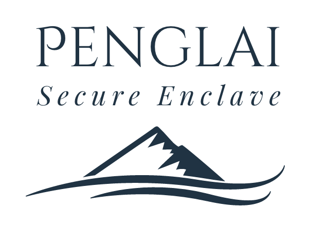

Penglai is a set of security solutions based on Trusted Execution Environment.

This repo contains an overview of the whole project.

It currently supports RISC-V platforms, including both high-performant MMU RISC-V64 arch and MCU (RISC-V32, no MMU).

## Systems

Penglai contains a set of systems satisfying different scenarios.

- **Penglai-TVM**: it is based on OpenSBI, supports fine-grained isolation (page-level isolation) between untrusted host and enclaves. The code is maintained in [Penglai-TVM](#).
- **Penglai-MCU**: it supports Global Platform, and PSA now. Not open-sourced. Refer [Penglai-MCU](#) for more info.
- **Penglai-sPMP** based on OpenSBI for Nuclei devices is maintained in [Nuclei SDK](https://github.com/Nuclei-Software/nuclei-linux-sdk/tree/dev_flash_penglai_spmp).
- **Penglai-sPMP**: it utilizes our sPMP proposal to provide basic enclave functionalities, based on old bbl. The prototype is avaialble [here](https://github.com/Penglai-Enclave/Penglai-Enclave-sPMP).


## Formal verification

We have built a framework, Pangolin, based on Serval, to formally verify the Penglai's secure monitor.

We have finished:

- The specifications on cross-enclave communication interfaces, i.e., acquire\_server\_enclave, enclave\_call, and enclave\_return.
- Code proof of the above three interfaces using refinement.

## Features

We highlight several features on Penglai which are novel over other TEE systems.

### Cross-enclave communication

Penglai supports the synchronous and asynchronous cross-enclave communication using the zero-copy memory transferring mechanism.

##### Synchronous IPC interface:

```c
struct call_enclave_arg_t
{
  unsigned long req_arg;
  unsigned long resp_val;
  unsigned long req_vaddr;
  unsigned long req_size;
  unsigned long resp_vaddr;
  unsigned long resp_size;
};

unsigned long acquire_enclave(char* name);;
unsigned long call_enclave(unsigned long handle, struct call_enclave_arg_t* arg);
void SERVER_RETURN(struct call_enclave_arg_t *arg);
```

As for synchronous cross-enclave communication, Penglai sdk provides three IPC-related interfaces: `acquire_enclave`, `call_enclave` and `SERVER_RETURN`. 

+ `Acquire_enclave` receives the callee enclave name and returns the corresponding enclave handler. 

+ `Call_enclave` has two parameters, one is the enclave handler, and another is the argument's structure: `struct call_enclave_arg_t`. `struct call_enclave_arg_t` contains six variables: `req_arg` and `resp_val` are the calling and return value passing by the register. `req_size` and `req_vaddr` indicate a memory range that will map to the callee enclave using the zero-copy mechanism. `resp_size` and `resp_vaddr` are similar to the `req_size` and `req_vaddr`,  which are ignored in the calling procedure, but will be filled by monitor in the return procedure.

  Call_enclave will be hanged until the calling procedure returns.

+ `SERVER_RETURN` also receives the `struct call_enclave_arg_t`, which indicates the `resp_size` and `resp_vaddr`.

Asynchronous IPC interface:

```c
unsigned long asyn_enclave_call(char* name, struct call_enclave_arg_t *arg);
```

`asyn_enclave_call` receives two parameters, one is the callee enclave name and another is the pointer of the `struct call_enclave_arg_t`, but only the req_vaddr and `req_size` are effective. When an enclave invokes the `asyn_enclave_call`, Penglai monitor will unmap these memory pages, and re-map them to the callee enclave before it running. In addition, asyn_enclave_call will not suspend the caller enclave procedure.

### Secure file system

Penglai adopts xv6fs and littlefs as its file system, serving enclaves.
It utilizes the encryption libraries in SDK to encrypt/decrypt the data and provide integrity protections.


### Encryption library in SDK

Penglai utilizes the mbedtls as its encryption library.

### Support existing frameworks

- PSA: description TODO
- GP: description TODO

## License Details

Mulan Permissive Software License，Version 1 (Mulan PSL v1)
